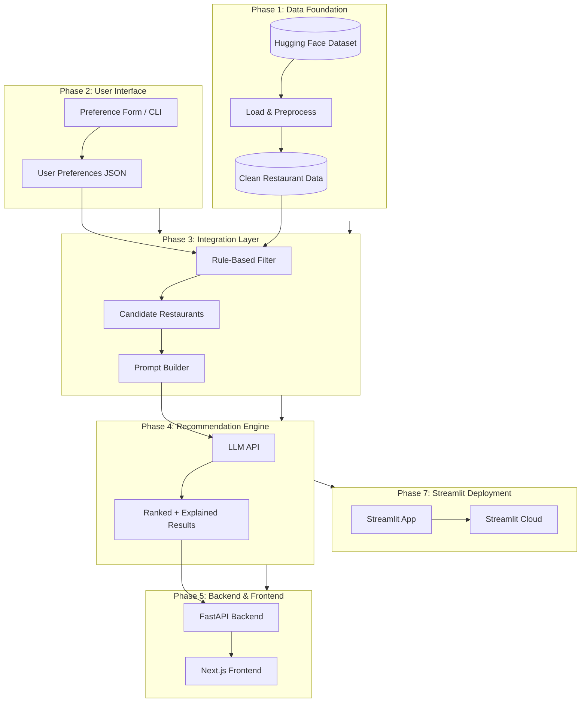
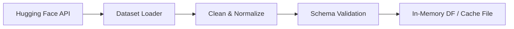
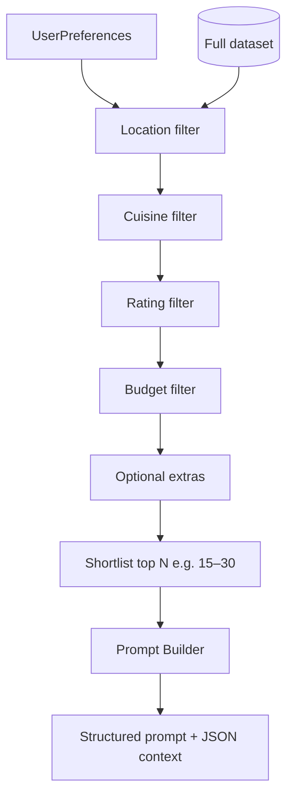
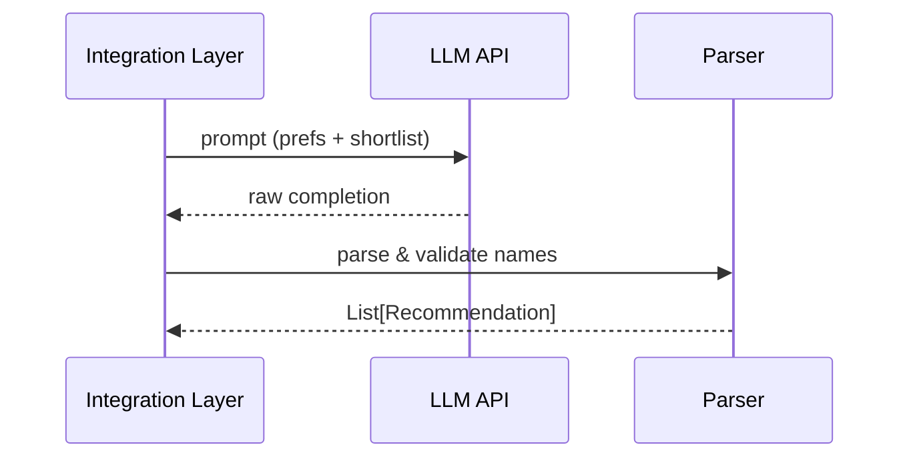
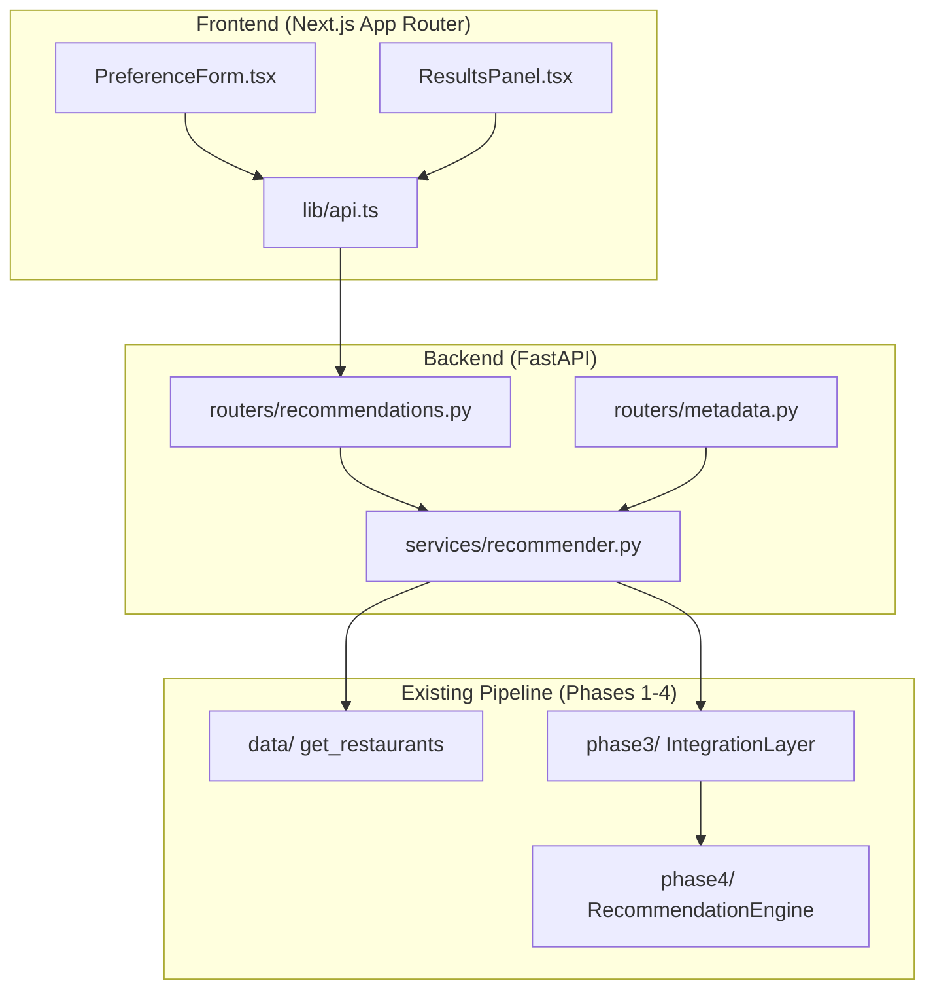
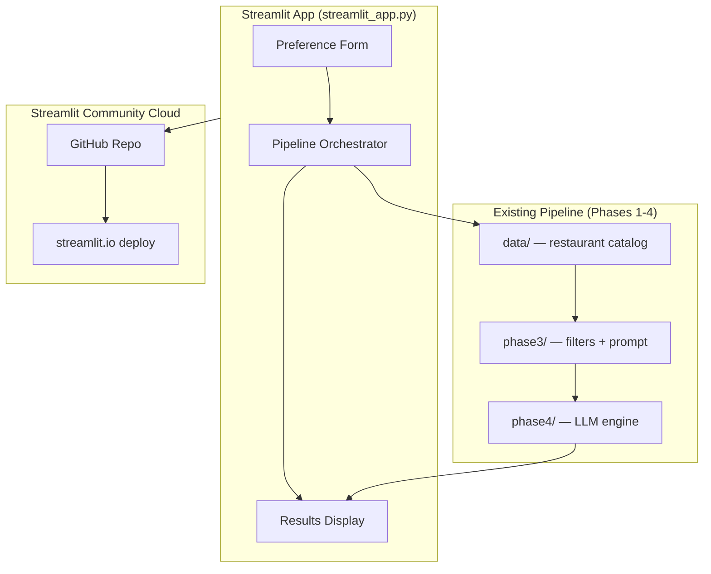
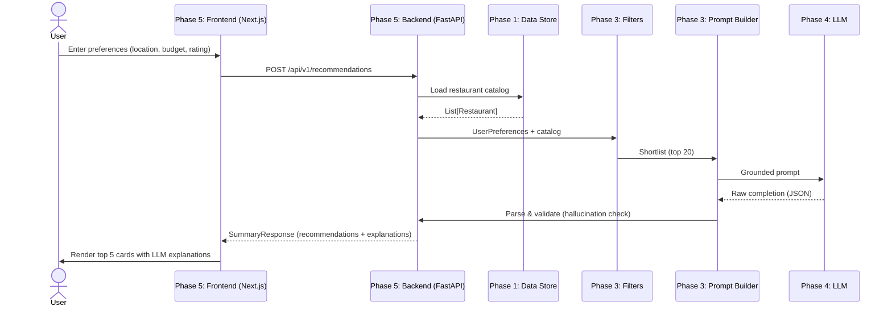
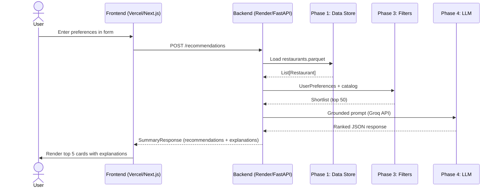
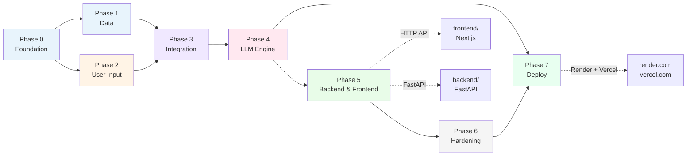

# Phase-Wise Architecture: AI-Powered Restaurant Recommendation System

This document describes a **phase-wise architecture** for the system defined in [Problemstatement.md](./Problemstatement.md). Each phase has a clear goal, components, inputs/outputs, and exit criteria before moving to the next phase.

---

## High-Level System View



**Core principle:** Structured data does the **narrowing**; the LLM does the **ranking and explanation**. The model should only recommend restaurants present in the filtered shortlist (grounded outputs).

---

## Phase Overview

| Phase | Name | Primary outcome |
|-------|------|-----------------|
| 0 | Foundation & setup | Runnable project skeleton, config, dependencies |
| 1 | Data ingestion & preprocessing | Clean, queryable restaurant dataset |
| 2 | User input layer | Validated user preference object |
| 3 | Integration layer | Filtered shortlist + LLM-ready prompt |
| 4 | Recommendation engine | Ranked list with AI explanations |
| 5 | Output & presentation | User-facing recommendation view |
| 6 | Hardening & delivery | Tests, error handling, optional deployment |
| 7 | Streamlit deployment | Public-facing demo on Streamlit Cloud |

---

## Phase 0: Foundation & Setup

**Goal:** Establish project structure, configuration, and shared contracts so later phases plug in cleanly.

### Components

| Component | Responsibility |
|-----------|----------------|
| **Project layout** | Separate modules: `data/`, `filters/`, `llm/`, `ui/`, `config/` |
| **Configuration** | API keys (LLM), dataset path/cache, default `top_k` |
| **Environment** | `.env` for secrets; `requirements.txt` or `pyproject.toml` |
| **Shared schemas** | `Restaurant`, `UserPreferences`, `Recommendation` dataclasses/types |

### Deliverables

- Repository structure and dependency install documented
- Config loader (no hardcoded API keys)
- Empty pipeline stub: `run_recommendation(preferences) -> results`

### Exit criteria

- Project runs locally with `python -m app` (or equivalent) without errors
- Types/schemas agreed for all phases

---

## Phase 1: Data Ingestion & Preprocessing

**Goal:** Load the Zomato dataset from Hugging Face and produce a normalized dataset for filtering.

**Maps to problem statement:** *§ System Workflow → 1. Data Ingestion*

### Components



| Component | Responsibility |
|-----------|----------------|
| **Dataset loader** | Fetch `ManikaSaini/zomato-restaurant-recommendation` via `datasets` library |
| **Normalizer** | Map raw columns → canonical fields: `name`, `location`, `cuisine`, `cost`, `rating` |
| **Cleaner** | Handle nulls, parse cost/rating types, dedupe rows |
| **Cache** | Optional: save processed CSV/Parquet to avoid re-download |

### Data model (canonical)

```text
Restaurant {
  id: string
  name: string
  location: string          # city / area
  cuisines: list[string]    # may be multi-value in source
  cost_for_two: number      # or cost_band: low | medium | high
  rating: float
  ...optional metadata
}
```

### Inputs / outputs

| Input | Output |
|-------|--------|
| Hugging Face dataset URL / name | `List[Restaurant]` or `pandas.DataFrame` |

### Exit criteria

- All required fields extracted and typed consistently
- Sample query: “restaurants in Bangalore with rating ≥ 4.0” works on raw data (no LLM yet)

---

## Phase 2: User Input Layer

**Goal:** Collect and validate user preferences into a structured object the rest of the pipeline consumes.

**Maps to problem statement:** *§ System Workflow → 2. User Input*

### Components

| Component | Responsibility |
|-----------|----------------|
| **Input surface** | Web form (Streamlit/Gradio) or CLI prompts |
| **Validator** | Required fields, allowed enums (budget band), rating range |
| **Preference model** | Single `UserPreferences` object passed downstream |

### User preference schema

```text
UserPreferences {
  location: string
  budget: enum(low, medium, high)
  cuisine: string | list[string]
  min_rating: float
  extras: dict                  # e.g. family_friendly, quick_service
}
```

### Inputs / outputs

| Input | Output |
|-------|--------|
| User form / CLI answers | Validated `UserPreferences` |

### Exit criteria

- Invalid input rejected with clear messages
- Preferences serialize to JSON for logging and prompt building

---

## Phase 3: Integration Layer

**Goal:** Filter the full dataset to a relevant shortlist and build an LLM prompt that grounds the model in real data.

**Maps to problem statement:** *§ System Workflow → 3. Integration Layer*

### Components



| Component | Responsibility |
|-----------|----------------|
| **Filter pipeline** | Sequential or composable filters on `Restaurant` records |
| **Shortlist cap** | Limit rows sent to LLM (token/cost control); e.g. top 20 by rating |
| **Prompt builder** | System + user messages: preferences + restaurant JSON + instructions |
| **Guardrails in prompt** | “Only recommend from the list below”; “cite restaurant names exactly” |

### Prompt design (conceptual)

1. **System:** Role = restaurant advisor; must use only provided data  
2. **Context:** User preferences + shortlist as JSON/table  
3. **Task:** Rank top 5, explain fit per restaurant, optional one-line summary  

### Inputs / outputs

| Input | Output |
|-------|--------|
| `UserPreferences` + full dataset | `shortlist: List[Restaurant]`, `prompt: string` |

### Exit criteria

- Filters return sensible subsets for test cases (Delhi + Italian + high budget)
- Prompt fits within model context limits
- Zero restaurants → graceful message (skip LLM call)

---

## Phase 4: Recommendation Engine (LLM)

**Goal:** Use the LLM to rank shortlist items and generate human-readable explanations.

**Maps to problem statement:** *§ System Workflow → 4. Recommendation Engine*

### Components

| Component | Responsibility |
|-----------|----------------|
| **LLM client** | OpenAI / Gemini / Ollama wrapper with retries & timeout |
| **Response parser** | Parse JSON or structured markdown into `Recommendation[]` |
| **Hallucination check** | Verify every returned name exists in shortlist |
| **Fallback** | If parse fails, return rule-based top-N with template explanation |

### Recommendation schema

```text
Recommendation {
  restaurant: Restaurant      # from shortlist
  rank: int
  explanation: string
}
Summary {
  recommendations: list[Recommendation]
  overall_summary: string?    # optional
}
```

### Sequence



### Inputs / outputs

| Input | Output |
|-------|--------|
| Prompt + shortlist | `Summary` with ranked recommendations |

### Exit criteria

- Top 5 recommendations with explanations for sample inputs
- No restaurant names outside the shortlist in output
- API errors handled without crashing the app

---

## Phase 5: Backend & Frontend Application (IMPLEMENTED)

**Status:** Implemented. The full-stack application lives in `backend/` and `frontend/` folders.

**Goal:** Build a full-stack web application with a RESTful backend API and modern frontend to deliver restaurant recommendations through an intuitive user interface.

**Maps to problem statement:** *§ System Workflow → 5. Output Display*

### Architecture Overview



### Backend (`backend/`)

The FastAPI backend is a thin HTTP wrapper around the existing Phase 1-4 pipeline. It does **not** duplicate business logic.

**Folder structure:**
```
backend/
├── app/
│   ├── main.py              # FastAPI app factory, CORS, lifespan
│   ├── routers/
│   │   ├── recommendations.py   # POST /api/v1/recommendations
│   │   └── metadata.py          # GET /api/v1/locations, /cuisines, /health
│   ├── schemas/
│   │   └── api.py           # Pydantic v2 request/response models
│   └── services/
│       └── recommender.py   # Orchestrates get_restaurants → IntegrationLayer → RecommendationEngine
├── requirements.txt         # fastapi, uvicorn, openai, etc.
├── Dockerfile               # Multi-stage, copies project root for imports
└── .dockerignore
```

**Key design decisions:**
- `PYTHONPATH=/app` in the container so `from models.schemas import ...` works from `backend/app/`.
- `RecommenderService` lazy-loads the catalog on first request (or during lifespan startup).
- Falls back to rule-based top-5-by-ranking if `GROQ_API_KEY` is missing or the LLM call fails.

### Backend API Endpoints

| Endpoint | Method | Description | Request | Response |
|----------|--------|-------------|---------|----------|
| `/api/v1/recommendations` | POST | Generate recommendations | `UserPreferencesRequest` | `SummaryResponse` |
| `/api/v1/locations` | GET | List unique locations from catalog | - | `{locations: [...]}` |
| `/api/v1/cuisines` | GET | List unique cuisines from catalog | - | `{cuisines: [...]}` |
| `/api/v1/health` | GET | Health check | - | `{status: "ok"}` |
| `/` | GET | Redirects to `/docs` (Swagger UI) | - | - |

### Frontend (`frontend/`)

A Next.js 14+ application using the **App Router**. All interactive components are client-side (`'use client'`) and styled with Tailwind CSS.

**Folder structure:**
```
frontend/
├── app/
│   ├── layout.tsx           # Root layout
│   ├── page.tsx             # Home page (form + results side-by-side)
│   ├── globals.css          # Tailwind directives
│   └── components/
│       ├── PreferenceForm.tsx   # Location, budget, cuisine, rating inputs
│       └── ResultsPanel.tsx     # Card-based top-5 display with star ratings
├── lib/
│   └── api.ts               # Typed fetch wrapper for backend calls
├── next.config.js           # output: 'standalone', API rewrites
├── tailwind.config.ts
├── package.json
├── Dockerfile               # Multi-stage build (node:20-alpine)
└── .dockerignore
```

**Features implemented:**
- Location input with datalist autocomplete (populated from `/api/v1/locations`).
- Budget selection via styled radio buttons (Low / Medium / High).
- Cuisine input with datalist autocomplete (populated from `/api/v1/cuisines`).
- Min rating slider (0.0 - 5.0, step 0.1).
- Loading skeletons while fetching recommendations.
- Result cards showing: rank badge, name, location, star rating, cuisines, cost for two, LLM explanation.
- Fallback mode banner when rule-based ranking is used.
- Error banner for API failures.
- Responsive two-column layout (form left, results right on desktop; stacked on mobile).

### Technology Stack (Implemented)

**Backend:**
- **Framework:** FastAPI (Python 3.11)
- **API Docs:** OpenAPI/Swagger auto-generated at `/docs`
- **Deployment:** Docker (python:3.11-slim)

**Frontend:**
- **Framework:** Next.js 14.2.5 (React 18, App Router)
- **Styling:** Tailwind CSS 3.4
- **HTTP Client:** Native `fetch` (typed wrapper in `lib/api.ts`)
- **Deployment:** Docker (node:20-alpine, standalone output)

**Infrastructure:**
- **Containerization:** Docker & Docker Compose
- **Orchestration:** `docker-compose.yml` at project root

### Environment Configuration

**Backend** reads from the existing `.env` at project root:
```env
GROQ_API_KEY=your_groq_key
CORS_ORIGINS=http://localhost:3000
```

**Frontend** (`docker-compose.yml` sets this at runtime):
```env
NEXT_PUBLIC_API_URL=http://localhost:8000/api/v1
```

### Docker Compose Setup

```yaml
services:
  backend:
    build:
      context: .
      dockerfile: backend/Dockerfile
    ports:
      - "8000:8000"
    env_file:
      - .env
    environment:
      - CORS_ORIGINS=http://localhost:3000

  frontend:
    build:
      context: ./frontend
      dockerfile: Dockerfile
    ports:
      - "3000:3000"
    environment:
      - NEXT_PUBLIC_API_URL=http://localhost:8000/api/v1
    depends_on:
      - backend
```

**Run locally:**
```bash
docker-compose up --build
```
- Backend: http://localhost:8000/docs
- Frontend: http://localhost:3000

### Exit Criteria (Met)

- Backend API serves all endpoints with proper error handling
- Frontend successfully calls backend and displays recommendations
- End-to-end flow: form submit → API call → results display
- Responsive design works on mobile, tablet, and desktop
- Docker compose brings up full stack locally
- API documentation available at `/docs` endpoint
- Reuses existing Phase 1-4 logic — no duplication

---

## Phase 6: Hardening & Delivery (IMPLEMENTED)

**Status:** Implemented. Phase 6 artifacts live in the `phase6/` folder.

**Goal:** Make the system reliable, testable, and demo-ready.

### Folder Structure

```
phase6/
├── tests/                          # Automated test suite
│   ├── test_filters.py             # Unit tests for filter pipeline
│   ├── test_hallucination_check.py # Tests for hallucination checker
│   ├── test_backend_api.py         # FastAPI endpoint tests
│   ├── test_recommendation_engine_mock.py  # Mock LLM integration tests
│   └── test_end_to_end.py          # Full pipeline E2E tests
├── logging/
│   ├── config.py                   # Structured logging configuration
│   └── middleware.py               # FastAPI request logging + latency tracking
├── deployment/
│   ├── health_check.py             # Standalone health check script
│   └── validate_stack.py           # Full stack validation script
└── README.md
```

### Testing

All tests run without network calls (no LLM API key needed):

```bash
python -m pytest phase6/tests/ -v
```

| Test file | What it covers |
|-----------|---------------|
| `test_filters.py` | FilterPipeline unit tests (location, cuisine, rating, budget, shortlist cap) |
| `test_hallucination_check.py` | HallucinationChecker verify + filter_valid_recommendations |
| `test_backend_api.py` | FastAPI endpoints: health, locations, cuisines, recommendations, validation errors |
| `test_recommendation_engine_mock.py` | Mock LLM responses, fallback on bad JSON, hallucination filtering |
| `test_end_to_end.py` | Full pipeline: preferences → fallback recommendations, validation, empty matches |

### Logging

The backend uses `phase6/logging/` for structured observability:

- **config.py**: Configures `asctime | LEVEL | logger_name | message` format.
- **middleware.py**: `RequestLoggingMiddleware` logs every request with method, path, status code, and latency in ms. Adds `X-Response-Time-Ms` response header.

The middleware is wired into `backend/app/main.py` automatically.

### Deployment Validation

```bash
# Health check only
python -m phase6.deployment.health_check

# Full stack validation (backend + frontend + recommendation)
python -m phase6.deployment.validate_stack

# Docker Compose
python -m phase6.deployment.validate_stack
```

### Security

- All secrets in `.env` (not committed to repo)
- `GROQ_API_KEY` read from environment, never hardcoded
- `.gitignore` excludes `.env`
- CORS configured to allow only the frontend origin

### Performance

- Dataset cached as Parquet in `data/cache/` to avoid re-download
- Shortlist capped at 20 restaurants (`shortlist_cap=20`) to control LLM token usage
- LLM timeout configurable via `GROQ_API_KEY` and model settings

### Exit Criteria (Met)

- [x] Documented run instructions in `phase6/README.md`
- [x] Automated test suite for filter logic (and more)
- [x] Meets [Problemstatement.md](./Problemstatement.md) success criteria end-to-end
- [x] Structured logging with latency tracking
- [x] Deployment validation scripts
- [x] Security: secrets in env only

---

## Phase 7: Streamlit Cloud Deployment

**Goal:** Package the full recommendation pipeline as a single-file Streamlit app and deploy it publicly on Streamlit Community Cloud — zero infrastructure, shareable via URL.

**Maps to problem statement:** *§ System Workflow → 5. Output Display (cloud-hosted)*

### Architecture Overview



### Components

| Component | Responsibility |
|-----------|----------------|
| **`ui/phase2/streamlit_app.py`** | Single-entry Streamlit UI — preference form + results rendering |
| **Pipeline imports** | Reuses `data/`, `phase3/`, `phase4/` directly (no FastAPI layer needed) |
| **`requirements.txt`** | Must include `streamlit`, `groq`, `datasets`, `pandas`, `pyarrow` |
| **`secrets.toml` / Streamlit Secrets** | `GROQ_API_KEY` stored in Streamlit Cloud secrets manager (never in repo) |
| **GitHub Actions (optional)** | Auto-deploy on push to `main` |

### Folder Structure

```
(project root)
├── ui/
│   └── phase2/
│       └── streamlit_app.py     # Entry point for Streamlit Cloud
├── requirements.txt              # Must list streamlit + all pipeline deps
├── .streamlit/
│   └── config.toml              # Optional: theme, server settings
└── data/cache/
    └── restaurants.parquet      # Pre-cached dataset (committed or generated on first run)
```

### Deployment Steps

1. **Push to GitHub** — ensure `streamlit_app.py`, `requirements.txt`, and `data/cache/restaurants.parquet` are committed.
2. **Connect to Streamlit Cloud** — go to [share.streamlit.io](https://share.streamlit.io), link the GitHub repo, set the entry file to `ui/phase2/streamlit_app.py`.
3. **Add secrets** — in the Streamlit Cloud dashboard → *Secrets* → add:
   ```toml
   GROQ_API_KEY = "your_groq_key_here"
   ```
4. **Deploy** — Streamlit Cloud installs `requirements.txt` and launches the app.
5. **Share URL** — the app is publicly accessible at `https://<app-name>.streamlit.app`.

### Environment Configuration

| Variable | Where set | Notes |
|----------|-----------|-------|
| `GROQ_API_KEY` | Streamlit Cloud Secrets | Never commit to repo |
| Dataset cache | `data/cache/restaurants.parquet` | Committed to avoid re-download on cold start |

### Inputs / Outputs

| Input | Output |
|-------|--------|
| User preference form (location, budget, cuisine, rating) | Top-5 restaurant cards with LLM explanations, rendered in browser |

### Exit Criteria

- App loads in browser via public Streamlit Cloud URL
- Preference form accepts location, budget, cuisine, min rating
- Recommendations display with restaurant name, rating, cuisines, cost, and LLM explanation
- Fallback to rule-based top-5 if `GROQ_API_KEY` is absent or LLM call fails
- No secrets hardcoded anywhere in the repo
- Cold start completes within 60 seconds (dataset loaded from Parquet cache)

---

## End-to-End Data Flow



### Render + Vercel Deployment Flow



---

## Suggested Module Mapping (Implementation)

| Module / file | Phase |
|---------------|-------|
| `config.py`, `.env.example` | 0 |
| `data/loader.py`, `data/preprocess.py` | 1 |
| `models/schemas.py` | 0–1 |
| `ui/app.py` or `cli.py` | 2, 5 (legacy) |
| `filters/pipeline.py` | 3 |
| `llm/prompt.py`, `llm/client.py`, `llm/parser.py` | 3–4 |
| `services/recommendation.py` | Orchestrates 3→4 |
| `backend/main.py` | 5 (FastAPI backend) |
| `backend/requirements.txt` | 5 (Backend dependencies) |
| `backend/render.yaml` | 5 (Render deployment config) |
| `frontend/app/page.tsx` | 5 (Next.js frontend) |
| `frontend/lib/api.ts` | 5 (Frontend API client) |
| `frontend/vercel.json` | 5 (Vercel deployment config) |
| `docker-compose.yml` | 5 (deployment - optional) |
| `phase6/tests/` | 6 (automated tests) |
| `phase6/logging/` | 6 (observability) |
| `phase6/deployment/` | 6 (validation scripts) |
| `tests/test_filters.py` | 6 |
| `DEPLOYMENT.md` | 7 (Deployment guide) |
| `data/cache/restaurants.parquet` | 7 (pre-cached dataset for cloud) |

---

## Phase Dependency Graph



**Parallel work:** After Phase 0, **Phase 1** (data) and **Phase 2** (UI mock) can progress in parallel until Phase 3 merges them.

---

## Alignment with Problem Statement

| Problem statement section | Architecture phase |
|---------------------------|-------------------|
| Data Ingestion | Phase 1 |
| User Input | Phase 2 |
| Integration Layer | Phase 3 |
| Recommendation Engine | Phase 4 |
| Output Display | Phase 5 |
| Success Criteria (E2E, grounded + useful) | Phases 3–5 + Phase 6 validation |
| Public demo / shareable URL | Phase 7 (Render + Vercel) |
